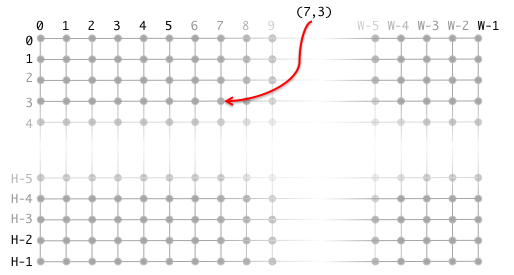
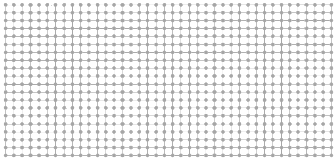
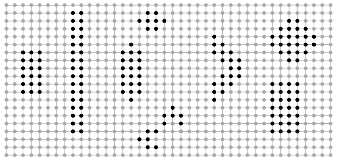
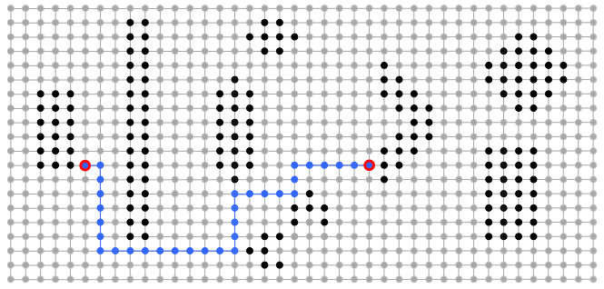
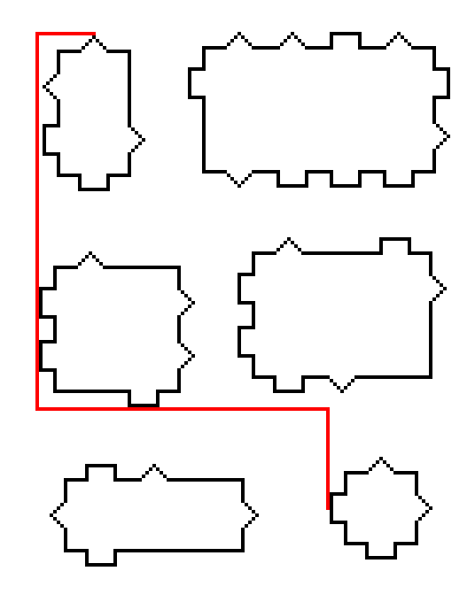
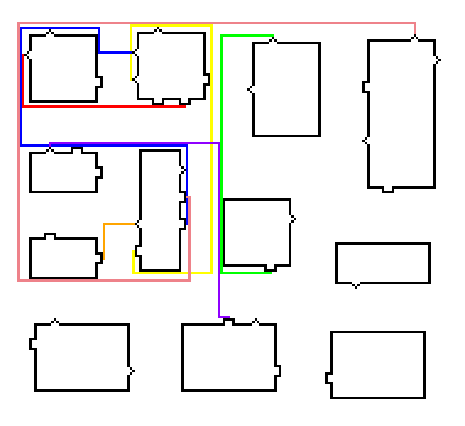
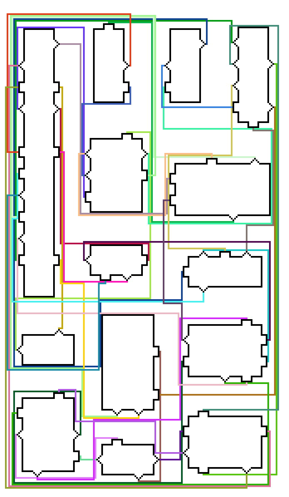

# Cicuit Router

Progetto del corso di Progettazione di Algoritmi a.a. 2013-2014

## Progetto

Si richiede di scrivere un programma che calcola le migliori linee di collegamento tra gli elementi di un circuito. Ovviamente non consideriamo il problema in tutta la sua generalità ma solamente una versione molto semplificata. Gli elementi e le linee del circuito sono definiti su una griglia di data larghezza $$$W$$$ e altezza $$$H$$$, come nella figura:



Tale griglia è vista come un grafo non diretto in cui ogni punto o nodo è identificato dalle sue coordinate $$$(x, y)$$$ con $$$0 \leq x \leq W - 1$$$ e $$$0 \leq y \leq H - 1$$$. Gli archi sono quelli mostrati nella figura: ogni nodo che non è sui bordi ha esattamente 4 nodi adiacenti. Una griglia (vuota) 40x30 è mostrata qui sotto:



Sulla griglia possono esserci degli elementi ognuno rappresentato da un gruppo connesso di nodi. Ad esempio, la griglia qui sotto ha 9 elementi i cui nodi sono marcati in nero:



Le linee che collegano gli elementi sono dei cammini nel grafo, come mostrato nella figura



dove una linea (o cammino), evidenziata in blu, collega i nodi marcati in rosso. I nodi da collegare non sono mai nodi che appartengono a degli elementi ma sono adiacenti a nodi di elementi. Il compito che il programma deve risolvere è il seguente. Data la specifica di una griglia, di un certo numero di elementi e di una lista di coppie di nodi, determinare per ogni coppia di nodi della lista, nell'ordine dato, una *linea di minimo costo* che collega la coppia di nodi. Per *linea* si intende un qualsiasi cammino nel grafo della griglia che non passa per i nodi degli elementi. Il *costo* di una linea $$$L$$$ è una tripla $$$(I, S, A)$$$ dove $$$I$$$ è il numero di incroci con altre linee, $$$S$$$ è il numero di svolte (nella figura sopra, la linea blu ha 6 svolte) e $$$A$$$ è il numero di archi (la lunghezza, la linea blu ha lunghezza 31) di $$$L$$$. I costi sono ordinati prima per incroci, poi per svolte e infine per lunghezza: $$ (I, S, A) \leq (I',S', A') \quad\Longleftrightarrow\quad I < I' \;\mathrm{OR}\; ((I = I' \;\mathrm{AND}\; S < S') \;\mathrm{OR}\; (I = I' \;\mathrm{AND}\; S = S' \;\mathrm{AND}\; A \leq A')) $$ Quindi, una linea di minimo costo significa una linea che rispetto a tutte quelle che collegano i due nodi dati ha il mimimo numero di incroci e tra quelle che minimizzano gli incroci ha il minimo numero di svolte e tra quest'ultime ha minima lunghezza. Due linee possono incrociarsi, cioè passare per lo stesso nodo, ma non possono avere archi in comune. In altre parole, non possono sovrapporsi procedendo in parallelo per due o più nodi. Oltre a questa condizione si può scegliere di imporre un ulteriore vincolo: una linea non può passare, e quindi né iniziare né terminare, in un nodo di svolta di un'altra linea. L'imposizione di questo, che chiameremo *vincolo di svolta*, è facoltativa e nella relazione si deve specificare se è stato imposto oppure no.

Le specifiche delle griglie, degli elementi e delle coppie di nodi da collegare sono contenute in un file `input.bin` che è descritto più avanti. Il programma quando eseguito deve leggere il file `input.bin` e scrivere i risultati nel file `output.bin`, entrambi i file devono essere nella stessa directory in cui si trova l'eseguibile. Non deve fare nient'altro, in particolare non deve chiedere input o stampare alcunché.

Per mostrare alcuni esempi rappresentiamo ogni nodo con un blocco di 4x4 pixels. Gli elementi possono essere specificati dando solamente i loro contorni (in nero). Nella figura qui sotto ci sono 6 elementi e una linea rossa di costo minimo (con 3 svolte). Si osservi che tra i due estremi ci sono molte altre linee di eguale costo minimo. Inoltre, ci sono linee di lunghezza inferiore ma con un numero maggiore di svolte.



In quest'altro esempio abbiamo 12 elementi e 7 linee di costo minimo.



Le linee sono calcolate nell'ordine: prima la rossa, poi l'arancione, la gialla, la verde, la blu, quella indaco e infine quella in violetto. Si noti come la linea gialla segue un percorso piuttosto lungo per evitare incroci con le linee che la precedono (la rossa e l'arancione). Anche la blu deve fare un percorso lungo con molte svolte per minimizzare gli incroci con le linee che la precedono, cioè le linee rossa, arancione, gialla e verde (ma l'incrocio con la gialla è inevitabile). Si osservi che se si cambia l'ordine con il quale sono calcolate le linee di costo minimo (cioè l'ordine delle coppie di nodi da collegare), le linee, dalla seconda in poi, e i loro costi minimi possono cambiare. Non solo, anche considerandole nello stesso ordine se si sceglie una linea di costo minimo piuttosto che un'altra questo può modficare le condizioni per le linee successive e quindi i loro costi minimi possono cambiare.

Per finire un esempio con 38 linee:



### Assunzioni

Si assume che le griglie abbiano dimensioni $$$W, H \leq 2000$$$.

### Formato del file di input

Il file `input.bin` è un file binario e quindi è una sequenza di bytes. Ogni byte ha un valore intero compreso tra 0 e 255. Quando diciamo che una coppia di bytes $$$b_1b_2$$$ codifica un valore intendiamo che tale valore $$$v$$$ è ottenuto così $$$v = 256*b_1 + b_2$$$ (per ragioni di portabilità). Il file `input.bin` codifica uno o più casi di test. I primi due bytes codificano il numero $$$N$$$ dei casi di test. Dopo di questi c'è la concatenazione delle codifiche $$$T_1T_2\cdots T_N$$$ dei casi di test. Ogni caso di test $$$T_i$$$ è una sequenza di bytes divisa in 3 blocchi di bytes consecutivi $$$BLK_1 BLK_2 BLK_3$$$ con i seguenti significati.

- $$$BLK_1$$$: 8 bytes suddivisi in 4 coppie con il significato:
  - bytes 1 e 2: larghezza della griglia
  - bytes 3 e 4: altezza della griglia
  - bytes 5 e 6: $$$N_1$$$ lunghezza $$$BLK_2$$$ (se zero, $$$BLK_2$$$ non è presente)
  - bytes 7 e 8: $$$N_2$$$ lunghezza $$$BLK_3$$$ (se zero, $$$BLK_3$$$ non è presente)
- $$$BLK_2$$$: codifiche degli elementi $$$E_1E_2\cdots E_k$$$ l'una di seguito all'altra e la somma delle loro lunghezze è esattamente $$$N_1$$$.
- $$$BLK_3$$$: gli estremi delle linee da calcolare, per ognuna di queste 8 bytes di cui i primi 4 codificano le coordinate $$$x$$$ e $$$y$$$ del primo estremo e gli altri 4 le coordinate $$$x$$$ e $$$y$$$ dell'altro estremo. In totale ci sono gli estremi di $$$N_2/8$$$ linee ($$$N_2$$$ è sempre un multiplo di 8).

Quindi la lunghezza totale della codifica del caso di test è $$$8 + N_1 + N_2$$$. La codifica $$$E_i$$$ di un elemento è la codifica (compressa) del suo contorno visto come sequenza delle coordinate dei suoi nodi. Prima di descrivere la codifica di un elemento dobbiamo dare alcune nozioni. Siano $$$(x,y)$$$ e $$$(x'y')$$$ le coordinate di due nodi distinti. Diciamo che sono *adiacenti* se o $$$x = x'$$$ e $$$|y-y'| \leq 1$$$ o $$$y = y'$$$ e $$$|x-x'| \leq 1$$$. Ciò equivale all'adiacenza tra nodi del grafo griglia. Diciamo invece che sono *vicini* se $$$|x-x'| \leq 1$$$ e $$$|y-y'| \leq 1$$$. Sia $$$(x_1,y_1),(x_2,y_2),…,(x_n,y_n)$$$ una sequenza di nodi distinti. Se per ogni coppia di nodi consecutivi nella sequenza $$$(x,y)$$$, $$$(x',y')$$$ si ha che $$$(x,y)$$$ e $$$(x'y')$$$ sono vicini, la sequenza è un *contorno*. Se per ogni coppia di nodi consecutivi $$$(x,y)$$$, $$$(x',y')$$$ si ha che $$$(x,y)$$$ e $$$(x'y')$$$ sono adiacenti, la sequenza è una linea (o cammino). Si noti che una linea è un tipo particolare di contorno. Un contorno è codificato da una sequenza di bytes $$$b_1b_2\cdots b_n$$$ tale che la prima coppia di bytes $$$b_1b_2$$$ codifica la coordinata $$$x$$$ e la seconda coppia $$$b_3b_4$$$ codifica la coordinata $$$y$$$ del primo nodo del contorno, i rimanenti bytes $$$b_5\cdots b_n$$$ codificato gli altri nodi del contorno come segue. L'ultimo byte $$$b_n$$$ ha valore 0 e indica la fine del contorno, ogni altro byte ha valore > 0. Ognuno di tali byte $$$b$$$ codifica una coppia di interi $$$(D,K)$$$ dove $$$D$$$ è il valore dei tre low bits e $$$K$$$ è il valore dei 5 hi bits, cioè, $$$D = b\verb"&0x07"$$$ (dove $$$\verb"&"$$$ è l'AND bit a bit) e $$$K = b\verb">>3"$$$ (dove $$$\verb">>3"$$$ è lo shift di tre posizioni verso i low bits). Quindi la sequenza $$$b_5\cdots b_{n-1}$$$ codifica una sequenza di coppie $$$(D_5,K_5),\ldots,(D_{n-1},K_{n-1})$$$ e ognuna di queste rappresenta una sequenza di nodi: $$$(D_i,K_i)$$$ rappresenta $$$K_i$$$ nodi nella direzione $$$D_i$$$ a partire dal nodo precedente, di coordinate $$$(x,y)$$$, che è o l'ultimo nodo della sequenza di $$$(D_{i-1},K_{i-1})$$$ se $$$i > 5$$$ o il primo nodo del contorno. Le possibili direzioni sono date dalle coppie di dislocazioni $$$(dx, dy)$$$ codificate dai possibili valori $$$0,1,\ldots,7$$$ di $$$D$$$ come segue:

- $$$0 \rightarrow (-1,-1)$$$ sinistra alto
- $$$1 \rightarrow (-1, 1)$$$ sinistra basso
- $$$2 \rightarrow (-1, 0)$$$ sinistra centro
- $$$3 \rightarrow (1, -1)$$$ destra alto
- $$$4 \rightarrow (1, 1)$$$ destra basso
- $$$5 \rightarrow (1, 0)$$$ destra centro
- $$$6 \rightarrow (0, -1)$$$ centro alto
- $$$7 \rightarrow (0, 1)$$$ centro basso

Quindi la sequenza dei nodi rappresentata da $$$(D_i,K_i)$$$ è la sequenza di nodi di coordinate $$$(x+dx, y+dy), (x+2dx, y+2dy),\ldots (x+K_idx, y+K_idy)$$$ dove $$$(dx, dy)$$$ è la coppia di dislocazioni codificata da $$$D_i$$$. Ad esempio, il contorno di un rettangolo di larghezza 25, altezza 100 e con lo spigolo in alto a sinistra nel nodo (600, 300) può essere codificato dalla seguente sequenza di 15 bytes:

```
0x02 0x58 0x01 0x2c 0xc5 0xff 0xff 0xff 0x37 0xc2 0xfe 0xfe 0xfe 0x2e 0x00
```

### Formato del file di output

Il file di output `output.bin` è un file binario che contiene una sequenza di bytes che codificano, nello stesso ordine del file di input, le linee calcolate. Quindi se nel file di input c'erano in totale $$$M$$$ coppie di nodi di cui calcolare le linee di collegamento tra tutti i casi di test, allora il file di output consiste nella concatenazione delle codifiche $$$L_1L_2\cdots L_M$$$ delle $$$M$$$ linee calcolate. La codifca di una linea segue lo stesso formato di quella di un contorno. Se per una coppia di nodi non c'è soluzione, la corrispondente codifica consiste nel singolo byte di valore 255. Si noti che questo byte non può essere scambiato per l'inizio della codifica di una linea normale perchè le coordinate, in base alle assunzioni, hanno valori di molto inferiori a 255*256.

Come si è già osservato le linee di minimo costo non sono, in generale, uniche. È sufficiente che ogni linea codificata nel file di output rispetti i vincoli e che sia di costo minimo relativamente alla situazione dovuta alle linee che la precedono (in quel caso di test) nell'ordine dato dal file di input.

#### Esempi

Esempi di file di input e output: [esempio 1](http://twiki.di.uniroma1.it/twiki/view/Algoritmi2/PALGProg2014_ES_1), [esempio 2](http://twiki.di.uniroma1.it/twiki/view/Algoritmi2/PALGProg2014_ES_2), [esempio 3](http://twiki.di.uniroma1.it/twiki/view/Algoritmi2/PALGProg2014_ES_3).

### Valutazione

Per la valutazione del progetto si terrà conto non solo della correttezza ma anche dell'efficienza in termini di memoria usata e di tempi di esecuzione. A questo proposito si fa presente che il file di input può contenere centinaia di casi di test. Si terrà anche in conto la qualità della relazione e l'organizzazione, la leggibilità e lo stile del codice sorgente.

### Gruppi

Il progetto può essere consegnato da un gruppo di al massimo tre membri.

### Linguaggi e modalità di consegna

Il progetto può essere realizzato o in linguaggio C o in Java. Devono essere consegnati tutti i sorgenti e un file in testo semplice chiamato `info.txt` (o in pdf chiamato `info.pdf`). Quest'ultimo file deve contenere i nomi dei membri del gruppo che ha realizzato il progetto ed altre informazioni specificate di seguito.

- Linguaggio C: devono essere consegnati tutti i sorgenti e il file `info` in una cartella compressa (`.zip`). Il file `info` deve anche contenere il comando che può essere usato per compilare i sorgenti e produrre l'eseguibile. Si deve poter ottenere l'eseguibile con un comando del tipo `gcc -std=c99 file1.c file2.c …` dove `file.c`, `file2.c`, ecc. sono tutti i sorgenti. Solamente la libreria standard del C può essere usata.
- Linguaggio Java: devono essere consegnati tutti i sorgenti in un file JAR eseguibile. Per generare il file JAR si devono seguire scrupolosamente queste [indicazioni](http://twiki.di.uniroma1.it/pub/Algoritmi2/PALGprogetto2013/info_jar.html). I sorgenti del progetto devono essere compilabili (senza errori) ed eseguibili nella piattaforma Java SE 1.7. Questo implica che nessuna libreria esterna, oltre a quelle di Java SE 1.7, può essere usata.

I file sorgenti devono essere ben commentati. Il file `info` deve contenere una relazione scritta che spieghi le scelte effettuate: le strutture di dati e gli algoritmi usati. In particolare, dovrà essere specificato il contenuto di ogni file. La relazione deve anche contenere una discussione dell'efficienza dell'implementazione in funzione della dimensione dei dati forniti in ingresso (cioe, le dimensioni della griglia, il numero di elementi e il numero di coppie da collegare). Se si vogliono aggiungere i risultati di sperimentazioni questi sono, ovviamente, benvenuti. Si ricorda che nella relazione deve essere specificato se è stato imposto o meno il vincolo di svolta.

La consegna del progetto deve avvenire in concomitanza con gli appelli della sessione estiva 2013-2014. Più precisamente, se si vuole fare la discussione orale del progetto in un dato appello è necessario consegnare il progetto entro una data prestabilita che precede di qualche giorno la data dello scritto dell'appello prescelto. Ecco l'elenco delle date entro le quali si può consegnare il progetto relativamente ad ogni appello:

- 28 giugno 2014 (per l'appello di giugno)
- 19 luglio 2014 (per l'appello di luglio)

Il progetto deve essere consegnato all'indirizzo:

```
X@gmail.com      (sostituire X con mp.progetti)
```